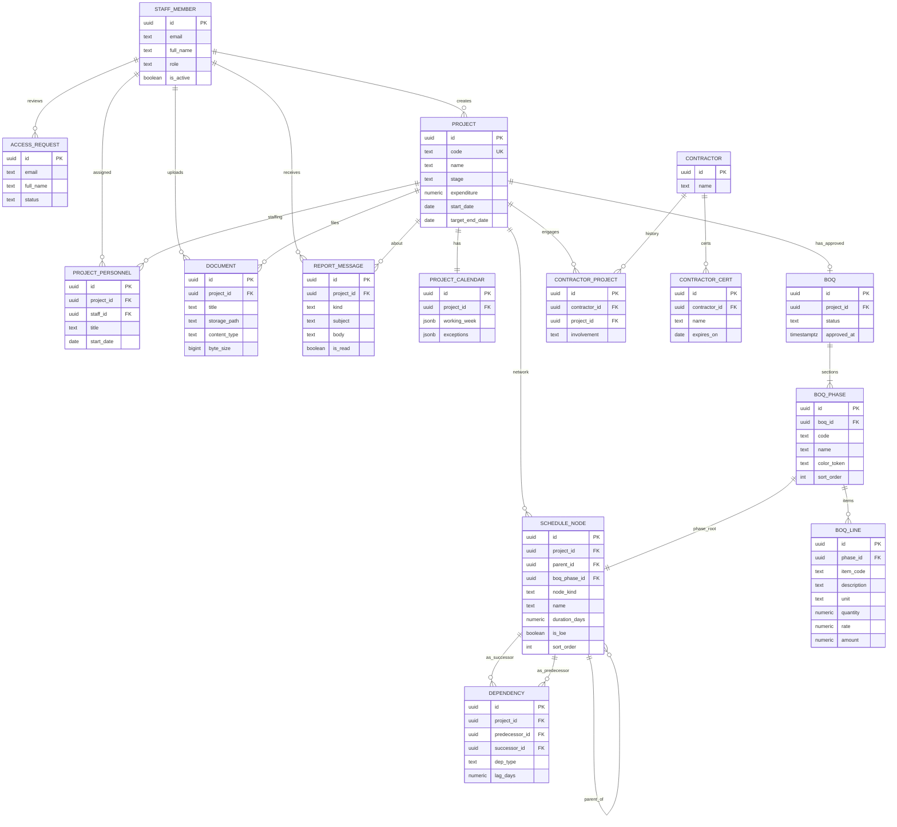

# ERD — Sadiconstruction (v1 free-tier)

> Logical entity-relationship diagram. Column detail and persist-vs-compute rules: [`DATA-MODEL.md`](DATA-MODEL.md). Glossary: [`CONTEXT.md`](../CONTEXT.md).

## Design stance

- **Single-organization internal app** on Supabase Free (not multi-tenant SaaS orgs).
- Persist **network inputs**; treat Computed Metrics as derived (optional cache columns allowed).
- **Adjacency list** for Schedule Node hierarchy (`parent_id`).
- Documents: **Storage object + metadata row** (never bytea in Postgres).
- CPM runs **client-side**; DB does not need to execute graph algorithms.

## Entity-relationship (Mermaid)

## Cardinality notes

| Relationship | Rule |
|--------------|------|
| Project → Project Calendar | Exactly one in v1 |
| Project → BOQ | Zero or one **approved** BOQ for Scheduling seed (drafts optional later) |
| BOQ Phase → Phase Root | Exactly one Schedule Node with `node_kind = phase_root` |
| Schedule Node → parent | Null only for Phase Roots; children stay under same Project |
| Dependency | Directed; unique `(predecessor_id, successor_id, dep_type)` recommended |
| Nested Summary / Leaf | `boq_phase_id` inherited from Phase Root lineage (denormalized for RLS/color) |

## Out of ERD v1

- Multi-calendar per activity  
- Resource assignments / leveling  
- Baseline snapshot tables (stub in DATA-MODEL as later)  
- Multi-organization tenancy  

## Related

[`DATA-MODEL.md`](DATA-MODEL.md) · [`adr/0001-client-side-cpm-on-free-tier.md`](adr/0001-client-side-cpm-on-free-tier.md) · [`adr/0002-single-org-internal-auth.md`](adr/0002-single-org-internal-auth.md)
