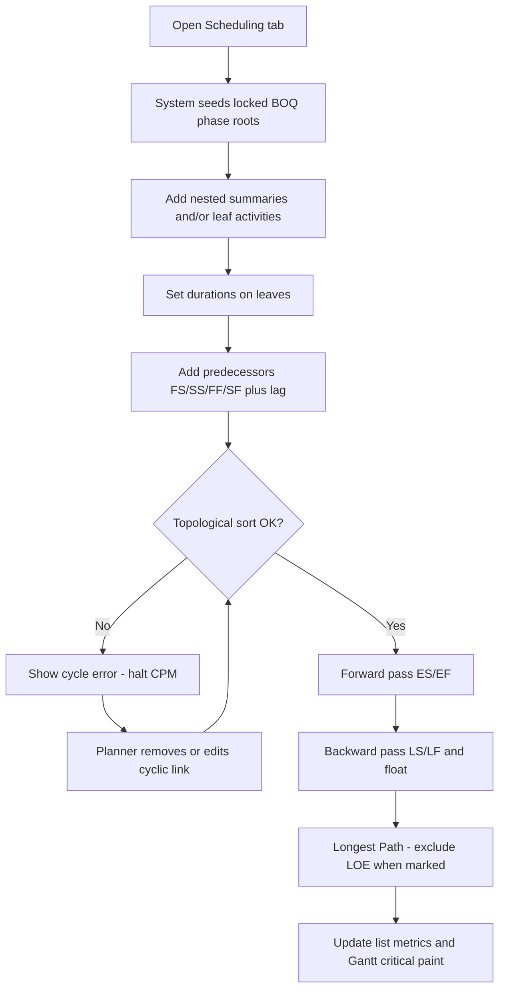

# Userflow — Critical-path Scheduling from BOQ

> Actor journeys for Scheduling. Complements [`PRD.md`](PRD.md) and [`Siteflow.md`](Siteflow.md). No schema.

## Actors

| Actor | Goal |
|-------|------|
| **Planner / Scheduler** | Build a valid network under BOQ phases; see critical path update as logic changes |
| **Project Manager** | Understand which work drives delay; communicate phase-level risk |

Assumes: user is authenticated and inside a project that has an approved BOQ (phase structure available).

---

## Flow A — Planner: create & evaluate schedule

### Steps

1. Planner opens **Scheduling** on the project.  
2. System shows **locked phase roots** from BOQ (e.g. A / B / C).  
3. Planner adds **nested summaries** and **leaves** under a phase; sets **durations** (working days on the global calendar).  
4. Planner sets **predecessors** (default FS; other types + lag as needed).  
5. On each structural/duration/link change, system runs **topo sort**.  
   - **Fail:** cycle banner; CPM stopped until fixed.  
   - **Pass:** forward pass → backward pass → float → **Longest Path** criticality.  
6. List columns and Gantt update; critical work is visually distinct.

### Success

Valid DAG; ES/EF/LS/LF and float visible; Longest Path highlighted; phase colors intact.

### Failure / recovery

| Failure | Recovery |
|---------|----------|
| Cycle in graph | Edit/remove bad predecessor; recalc resumes |
| Empty under phases | Add at least one leaf with duration and links as needed |
| Trying to delete/move a BOQ phase root | Blocked; explain WBS is owned by BOQ |

---

## Flow B — Planner: refine after a change

1. Planner changes a duration or predecessor on a critical (or near-critical) activity.  
2. System recalculates (same engine path as Flow A).  
3. Planner checks whether Longest Path / float shifted and adjusts logic or durations.

**Success:** New critical set and floats match the updated network.  
**Fail:** Same cycle handling as Flow A.

---

## Flow C — PM: review critical path

1. PM opens **Scheduling** (read-heavy; may not edit).  
2. Scans Gantt for **critical** bars and list for **total float**.  
3. Optionally cross-checks **BOQ** tab for phase scope / cost context.  
4. Uses phase coloring to explain impact (e.g. Site Works vs Concrete) to stakeholders.

**Success:** PM can name the driving sequence and which phases it touches.  
**Fail:** Empty schedule → send back to planner (Flow A). Invalid cycle → planner must fix before review is meaningful.

---

## Out of these flows

- Upload / import from Project Libre or MS Project  
- Switching Retained Logic ↔ Progress Override  
- Editing BOQ quantities or inventing new billable phases from Scheduling  
- Multi-calendar assignment per task  

## Related docs

[`IDEA.md`](../IDEA.md) · [`PRD.md`](PRD.md) · [`Siteflow.md`](Siteflow.md)

## Mockups

- High-fidelity interactive: [`mockups/scheduling-clearwater.html`](mockups/scheduling-clearwater.html)
- High-fidelity PNG: [`mockups/scheduling-hf-impeccable.png`](mockups/scheduling-hf-impeccable.png)
