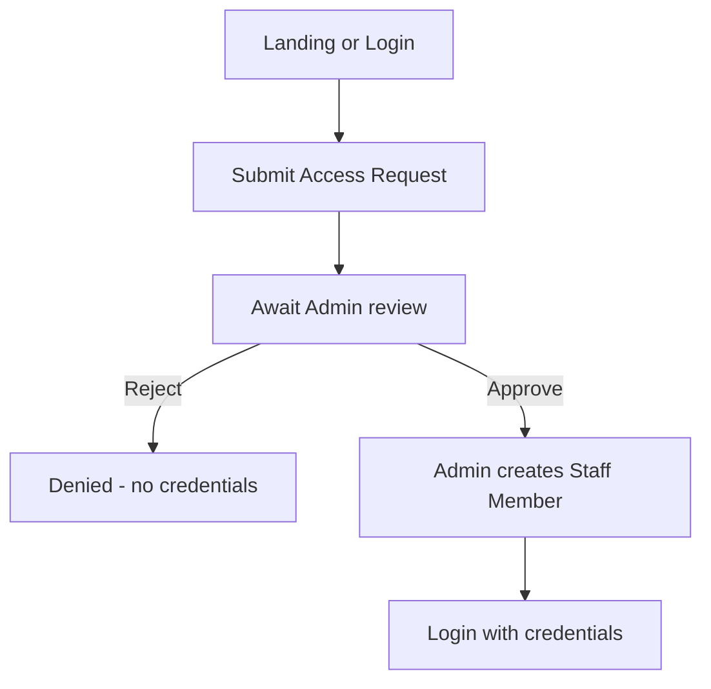
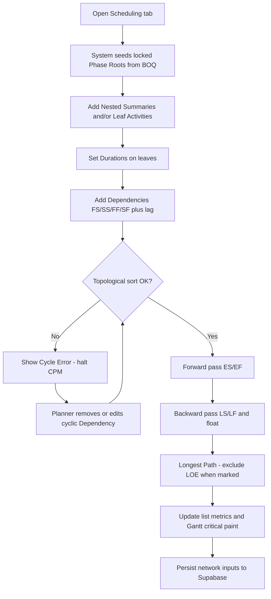

# Userflow — Sadiconstruction journeys

> Solidified 2026-09-15. Complements [`PRD.md`](PRD.md) and [`Siteflow.md`](Siteflow.md). Glossary: [`CONTEXT.md`](../CONTEXT.md).

## Actors

| Actor | Goal |
|-------|------|
| **Guest** | Submit an Access Request |
| **Admin** | Approve Access Requests; assign Roles |
| **Planner / Scheduler** | Build a Valid Network under BOQ Phases; see Longest Path update as logic changes |
| **Project Manager** | Understand which work drives delay; communicate phase-level risk |

Assumes for Scheduling flows: Staff Member is authenticated and inside a Project that has an approved BOQ (phases available).

---

## Flow 0 — Guest: Request Access

**Success:** Guest becomes Staff Member and can reach the shell.  
**Fail:** Denied or incomplete form; no partial auth.

*Resolved:* notification channel is in-app queue for v1 — [`OPEN-DECISIONS.md`](OPEN-DECISIONS.md) D3.

---

## Flow 1 — Staff: enter shell & open project

1. Staff Member logs in.  
2. Lands on **Projects** directory.  
3. Filters by Project Stage / search / sort as needed.  
4. Opens a Project → default tab Overview (or restored tab).  
5. Navigates to **BOQ** (view) or **Scheduling**.

**Success:** Project detail tabs available; BOQ readable when approved data exists.

---

## Flow A — Planner: create & evaluate schedule

### Steps

1. Planner opens **Scheduling** on the Project.  
2. System shows **locked Phase Roots** from BOQ (e.g. A / B / C).  
3. Planner adds **Nested Summaries** and **Leaf Activities**; sets **Durations** (working days on the Project Calendar).  
4. Planner sets **Dependencies** (default FS; other types + lag as needed).  
5. On each structural / duration / link change, client CPM Engine runs **topo sort**.  
   - **Fail:** Cycle Error banner; CPM stopped until fixed.  
   - **Pass:** forward → backward → float → **Longest Path**.  
6. List columns and Gantt update; critical work is visually distinct.  
7. Network inputs (not Computed Metrics as sole truth) persist to Supabase.

### Success

Valid Network; ES/EF/LS/LF and float visible; Longest Path highlighted; phase colors intact.

### Failure / recovery

| Failure | Recovery |
|---------|----------|
| Cycle in graph | Edit/remove bad Dependency; recalc resumes |
| Empty under phases | Add at least one Leaf Activity with Duration and links as needed |
| Trying to delete/move a Phase Root | Blocked; explain WBS is owned by BOQ |
| No BOQ phases | Gate: ensure approved BOQ before Scheduling authoring |

---

## Flow B — Planner: refine after a change

1. Planner changes a Duration or Dependency on a critical (or near-critical) Leaf Activity.  
2. System recalculates (same engine path as Flow A).  
3. Planner checks whether Longest Path / float shifted and adjusts logic or Durations.  
4. Changes persist.

**Success:** New critical set and floats match the updated network.  
**Fail:** Same Cycle Error handling as Flow A.

---

## Flow C — PM: review critical path

1. PM opens **Scheduling** (read-heavy; Project Manager cannot edit — ADR 0005).  
2. Scans Gantt for **critical** bars and list for **total float**.  
3. Optionally cross-checks **BOQ** tab for phase scope / cost context.  
4. Uses phase coloring to explain impact (e.g. Site Works vs Concrete) to stakeholders.

**Success:** PM can name the driving sequence and which BOQ Phases it touches.  
**Fail:** Empty schedule → send back to planner (Flow A). Cycle Error → planner must fix before review is meaningful.

---

## Flow D — Admin: BOQ presence (prerequisite)

1. Admin (or designated Role) ensures an approved BOQ exists for the Project (ingestion path TBD).  
2. BOQ Phases appear on the BOQ tab (view-only).  
3. Scheduling can seed Phase Roots.

*Resolved:* Admin CSV upload (plus demo seed) — [`OPEN-DECISIONS.md`](OPEN-DECISIONS.md) D4.

---

## Out of these flows

- Upload / import from Project Libre or MS Project  
- Switching Retained Logic ↔ Progress Override  
- Editing BOQ quantities or inventing new billable phases from Scheduling  
- Multi-calendar assignment per Leaf Activity  
- Baseline / delay snapshot authoring (post-foundation)

## Related docs

[`IDEA.md`](../IDEA.md) · [`PRD.md`](PRD.md) · [`Siteflow.md`](Siteflow.md) · [`TICKETS.md`](TICKETS.md)

## Mockups

- High-fidelity interactive: [`mockups/scheduling-clearwater.html`](mockups/scheduling-clearwater.html)
- High-fidelity PNG: [`mockups/scheduling-hf-impeccable.png`](mockups/scheduling-hf-impeccable.png)
