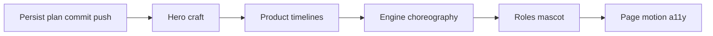

# Site Mark Landing — Craft Pass Plan

> **For agentic workers:** REQUIRED SUB-SKILL: Use superpowers:executing-plans or subagent-driven-development. Steps use checkbox (`- [ ]`) syntax.

**Goal:** Close the gap between the Site Mark Phases *architecture* already on `/` and the *craft bar* (design density + intentional animation) promised in the metaprompt / phases spec.

**Architecture:** Keep the six-section Site Mark shell in [`src/LandingPage.tsx`](src/LandingPage.tsx) and [`src/features/landing/sitemark/`](src/features/landing/sitemark/). Do not add Fracture, Lenis, or remount blueprint/formwork. Upgrade in place: Hero mesh/camera/layout, Product scripted demos, Engine pass choreography, Roles mascot/transitions, page-level enter/hover motion — still Site Mark tokens only.

**Tech Stack:** Existing — R3F/drei/three, GSAP (+ ScrollTrigger where needed), Framer Motion, `sitemark.css` tokens.

**Spec (binding):** [`docs/superpowers/specs/2026-09-23-landing-sitemark-phases-design.md`](docs/superpowers/specs/2026-09-23-landing-sitemark-phases-design.md)

**Branch / publish:** Work lives on `feat/landing-revamp` (no upstream yet). First task writes this plan under `docs/superpowers/plans/`, commits scoped landing + plan files, and `git push -u origin feat/landing-revamp`.

## Global Constraints

- Site Mark only: `#EEF1F0` / `#E2E7E5` / `#0E1210` / `#D4FF4A` critical-only; Syne · Manrope · IBM Plex Mono; 2px controls; no pills/card grids/purple SaaS
- Exactly six sections; no Fracture revival
- Motion earns presence: shared `--sm-ease-enter` / `--sm-ease-swap`; `prefers-reduced-motion` = static resting frames
- Hero stays R3F discrete phases (Massing → Structure → Envelope → Fit-out); phase clarity over photorealism
- Proof stays zero-friction (already OK); only light polish if time remains after Roles
- Do not commit `.cursor/settings.json` or formwork review PNGs unless explicitly needed

## Review Focus

- First viewport brand test + full-bleed hero plane (not a bordered thumbnail)
- Visible phase morph + camera cut per beat; captions composed into the plane
- Product demos read as staged UI stories, not opacity swaps
- Engine: visible forward/backward sweeps; float slackens; spine ignites in `--sm-mark` only
- Roles mascot feels designed; exclusive content + simultaneous morph
- Reduced-motion still readable everywhere

## Target files

```
docs/superpowers/plans/2026-09-23-landing-sitemark-craft-pass.md   # this plan (persisted)
src/LandingPage.tsx
src/features/landing/sitemark/
  sitemark.css
  phases.ts
  hero/BuildPhases.tsx
  hero/BuildPhasesScene.tsx
  hero/BuildingMesh.tsx          # major rewrite
  ProductDemos.tsx               # scripted timelines
  EngineDiagram.tsx              # pass sweeps + ScrollTrigger/IO
  RolesToggle.tsx / Mascot.tsx   # redesign + staged swap
  ProofGraph.tsx                 # optional quiet polish only
DESIGN.md                        # note craft-pass status if needed
```



---

### Task 0: Persist plan, commit branch, push to origin

**Files:** Create `docs/superpowers/plans/2026-09-23-landing-sitemark-craft-pass.md` (full copy of this plan). Commit scoped Site Mark Phases landing + specs/DESIGN already in the worktree.

- [ ] Write the craft-pass plan markdown under `docs/superpowers/plans/`
- [ ] Stage: `src/LandingPage.tsx`, `src/features/landing/sitemark/**`, `DESIGN.md`, `docs/superpowers/specs/**`, `docs/superpowers/plans/**`, `index.html` if fonts/meta changed — exclude `.cursor/`, formwork review assets, unused blueprint unless already required
- [ ] Commit with message focused on why: Site Mark Phases landing scaffold + craft-pass plan on `feat/landing-revamp`
- [ ] `git push -u origin HEAD` (branch `feat/landing-revamp`)
- [ ] Verify remote: `git status -sb` shows tracking `origin/feat/landing-revamp`

**Done when:** Plan and current landing are on GitHub under `feat/landing-revamp`.

---

### Task 1: Hero — building, camera, full-bleed plane

**Files:** [`BuildingMesh.tsx`](src/features/landing/sitemark/hero/BuildingMesh.tsx), [`BuildPhasesScene.tsx`](src/features/landing/sitemark/hero/BuildPhasesScene.tsx), [`BuildPhases.tsx`](src/features/landing/sitemark/hero/BuildPhases.tsx), [`phases.ts`](src/features/landing/sitemark/phases.ts), [`sitemark.css`](src/features/landing/sitemark/sitemark.css), [`LandingPage.tsx`](src/LandingPage.tsx)

**Ruling:** Readable low-poly *building* (floors, column grid, slab edges, punched openings, envelope panels) — not random grey boxes. Phase changes = hard LOD visibility + 0.6–0.9s camera lerp (expo-out). Kill continuous idle spin; use subtle settle only. Hero plane is edge-to-edge of the right column / bleeds to viewport edge on desktop — remove card border treatment.

- [ ] Rebuild `BuildingMesh` layers to match phase flags with clear silhouette differences
- [ ] Camera keyframes in `phases.ts` more distinct (high ¾ → low upshot → elevation → pullback)
- [ ] Caption: integrated bottom-left of plane; crossfade on phase change (200ms)
- [ ] Copy column: Framer/GSAP enter stagger (wordmark → lede → support → CTAs) once on load
- [ ] Reduced-motion: Fit-out static; no camera roam; captions static
- [ ] Manual: brand test; mobile stack under copy; no chips on media

**Done when:** Hero feels like a programme building in phases, not a boxed demo.

---

### Task 2: Product — scripted mini-demo timelines

**Files:** [`ProductDemos.tsx`](src/features/landing/sitemark/ProductDemos.tsx), `sitemark.css`

**Ruling:** Each module gets a 1.2–2.0s GSAP or Framer timeline (once-then-hold or short loop): Projects = row select → detail fields type/settle; BOQ = phase rows cascade → lock stamps; Scheduling = nest indent → Gantt bars draw left-to-right with one mark stroke. Switching targets cancels prior timeline and crossfades (450ms). Hover/focus/tap share `setActive`.

- [ ] Replace opacity-only demos with staged sequences + fake cursor or selection ring where it aids reading
- [ ] Resting frame always legible before play
- [ ] Reduced-motion: jump to final hold frame of active demo
- [ ] Manual: keyboard-only path works

**Done when:** Demos read as someone using the product UI.

---

### Task 3: Engine — pass choreography

**Files:** [`EngineDiagram.tsx`](src/features/landing/sitemark/EngineDiagram.tsx), `sitemark.css`

**Ruling:** Keep SVG (no dashboard). Add visible sweep geometries (gradient stroke or moving mask) for forward then backward; float edges animate to dashed + lower opacity; Longest Path draws last in `--sm-mark` only. Autoplay once on enter (IntersectionObserver), then hold. Step label updates in sync. Optional discrete step buttons only if they do not clutter.

- [ ] Rewrite timeline so each STEPS beat is visually distinct for ≥400ms
- [ ] Reduced-motion: final labeled diagram only
- [ ] Manual: mark color nowhere except spine

**Done when:** Engine teaches CPM as motion, not a static chart fade-in.

---

### Task 4: Roles — mascot redesign + staged swap

**Files:** [`Mascot.tsx`](src/features/landing/sitemark/Mascot.tsx), [`RolesToggle.tsx`](src/features/landing/sitemark/RolesToggle.tsx), `sitemark.css`

**Ruling:** Redesign flat vector site figure (proportions, hat/clipboard props, posture). Swap sequence: mascot morph 300ms → content enter 200ms (or simultaneous if reduce is false). Toggle remains 2px segment, not pills. Mark accent only on prop.

- [ ] New SVG poses for Planner / PM
- [ ] AnimatePresence choreography per ruling
- [ ] Reduced-motion: instant swap
- [ ] Manual: only one role’s bullets visible

**Done when:** Roles section feels intentional and on-brand.

---

### Task 5: Page motion + a11y smoke

**Files:** `LandingPage.tsx`, `sitemark.css`, light touches on Proof if needed

- [ ] Section heads (kicker/h2/p) enter on scroll with shared ease (once); stagger children 40–60ms
- [ ] Button/target hover: border/ink weight, no glow
- [ ] Confirm focus-visible on all interactive controls
- [ ] Proof: keep zero-friction; optional path opacity already present — do not add tutorial friction
- [ ] Desktop + ~375px pass of acceptance checklist (spec §9 craft items)
- [ ] Commit craft-pass code on `feat/landing-revamp` and push (separate commit from Task 0)

**Done when:** Page feels choreographed end-to-end; remote branch updated.

## Out of scope

- New sections, Fracture, Lenis, WebGL redesign of Engine/Proof as R3F
- Photoreal / AI video hero
- Committing Impeccable formwork review screenshots or `.cursor/settings.json`
