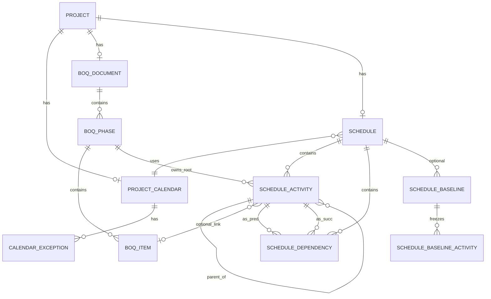

# CPM + BOQ data-model practices (for ERD)

> Research note · 2026-09-15 · Sadiconstruction Scheduling  
> Goal: entity/attribute checklist suitable for drafting an ERD under locked product constraints.

> **Applied in:** [`../ERD.md`](../ERD.md) · [`../DATA-MODEL.md`](../DATA-MODEL.md) · ADR 0003 / 0004. Persist inputs; recompute Longest Path client-side.

---

## Product constraints (locked)

| Constraint | Implication for persistence |
|---|---|
| One global project calendar | No per-activity `calendar_id`; calendar exceptions live at project scope |
| Retained Logic only | Store as project schedule option (fixed); no Progress Override toggle in v1 |
| Nested summaries under BOQ phases | Schedule tree: BOQ phase root → optional nested summaries → leaf activities |
| First-party CPM engine (JS), Longest Path criticality | Persist network inputs; recompute ES/EF/LS/LF/float/criticality in-app |
| BOQ view-only from scheduling | Schedule cannot create/rename/delete billable phases; FK ownership from BOQ → WBS |
| Free tier Supabase | Prefer lean tables; cache computed columns optionally for list/Gantt reads, not as source of truth |

Related product docs: [`Userflow.md`](../Userflow.md), prior research [`2026-09-14-deep-research-cpm-scheduling.md`](./2026-09-14-deep-research-cpm-scheduling.md), [`2026-09-14-pert-cpm-projectlibre.md`](./2026-09-14-pert-cpm-projectlibre.md).

---

## 1. AACE RP 49R-06 — what must be stored vs computed

**Primary source:** AACE International Recommended Practice No. 49R-06, *Identifying the Critical Path* (Rev. March 5, 2010). Public mirrors: [Alpha Corporation PDF](https://www.alphacorporation.com/documents/49R-06.pdf), [AACE TOC entry](https://web.aacei.org/docs/default-source/toc/toc_49r-06.pdf). Official purchase/hosting: [AACE PathLMS 49R-06](https://www.pathlms.com/aace/courses/2928/documents/3834).

### Definitions that drive the model

- **Critical path (conceptual):** “the longest logical path through the CPM network” — activities that determine the shortest time for project completion ([49R-06](https://www.alphacorporation.com/documents/49R-06.pdf)).
- **Four identification methods** (software may disagree on the same network):
  1. Lowest Total Float  
  2. Negative Total Float  
  3. **Longest Path** (product choice)  
  4. Longest Path Value Method  
- **Longest Path algorithm (store inputs, compute membership):**  
  1. Forward pass → early dates for all activities.  
  2. Find activities whose **early finish equals the project’s latest calculated early finish**.  
  3. Trace **driving relationships** backward to project start.  
  Driving relationship (Primavera definition quoted in RP): a relationship where the predecessor’s completion (as constrained by that link) dictates the successor’s early dates — i.e. relationship free float ≈ 0 ([49R-06](https://www.alphacorporation.com/documents/49R-06.pdf); Oracle P6: [Define critical activities as Longest Path](https://docs.oracle.com/cd/F88966_01/p6help/en/90519.htm)).
- **Float definitions in the RP** (computed, not authored):
  - **Total Float:** delay allowed without delaying project early finish (or constrained milestone).  
  - **Free Float:** delay allowed without affecting any successor’s early start.  
  - High free float is a *diagnostic* for missing logic, not a persisted “truth” field.

### Persist vs compute (49R-06 lens)

| Persist (authored / structural) | Recompute on every schedule run |
|---|---|
| Activity identity, hierarchy (WBS), duration | ES, EF (forward pass) |
| Relationships: type FS/SS/FF/SF + lag | LS, LF (backward pass) |
| Calendar working rules (here: one project calendar) | Total float, free float |
| Constraints if ever supported (not v1 focus) | Longest-path membership / `is_critical` |
| Progress actuals / remaining duration (later) | Driving-relationship flags |
| Calculation mode (Retained Logic — fixed) | Near-critical rankings (optional UI) |

**Do not treat `is_critical` or float as authoritative stored facts.** 49R-06 stresses that TF-based criticality breaks under multiple calendars, constraints, LOE/hammocks, and out-of-sequence progress; Longest Path is recommended when calendars/constraints distort float ([49R-06](https://www.alphacorporation.com/documents/49R-06.pdf)). With one global calendar, TF≈0 and Longest Path often coincide, but the product still commits to **Longest Path** as the criticality rule.

**LOE / hammocks / WBS summaries:** RP states these are placeholders that summarize intervals/float of children and should not drive critical-path membership the way true activities do ([49R-06](https://www.alphacorporation.com/documents/49R-06.pdf)). Persist a `node_kind` / `is_loe` flag; exclude LOE from Longest Path when marked ([Userflow.md](../Userflow.md)).

**Retained Logic note:** 49R-06 / companion practice warn that Progress Override changes which predecessors the Longest Path backward-trace follows. Product locks **Retained Logic** ([Oracle P6 schedule settings](https://docs.oracle.com/cd/F88966_01/p6help/en/90519.htm)): remaining duration of a progressed activity waits until predecessors finish.

---

## 2. Standard CPM fields (canonical attribute set)

Aligned with textbook CPM ([PMI — Understanding the basics of CPM calculations](https://www.pmi.org/learning/library/basics-cpm-scheduling-software-axon-8170)), MSPDI interchange ([Microsoft Learn — Task elements](https://learn.microsoft.com/en-us/office-project/xml-data-interchange/task-elements-and-xml-structure?view=project-client-2016)), and Oracle CPP/P6 field maps ([P6 CPP Import/Export Data Map](https://docs.oracle.com/cd/F51301_01/English/Mapping_and_Schema/cpp_import_export_data_map/cpp_import_export_data_map.pdf)).

### Activity (leaf or summary)

| Field | Role | Persist? |
|---|---|---|
| Activity ID / UID | Stable identity | **Yes** |
| Name / description | Display | **Yes** |
| WBS / outline code | Hierarchy code (e.g. B.2.1) | **Yes** (or derive from tree) |
| Duration (working days) | Network input | **Yes** (leaves); summaries roll up |
| Calendar | Working-time base | **Project-level only** (constraint) |
| Milestone / summary / LOE flags | Node semantics | **Yes** |
| Percent complete / actual start-finish / remaining duration | Progress (later) | Optional later |
| Early Start / Early Finish | Forward pass | **Compute** (optional cache) |
| Late Start / Late Finish | Backward pass | **Compute** |
| Total float / Free float | Slack | **Compute** |
| Critical / on longest path | Criticality | **Compute** |

### Dependency (relationship)

| Field | Role | Persist? |
|---|---|---|
| Predecessor activity id | From node | **Yes** |
| Successor activity id | To node | **Yes** |
| Type | FS=0, SS, FF, SF (MSPDI `PredecessorLink/Type`) | **Yes** |
| Lag (lead = negative) | Offset in working periods (calendar-aware) | **Yes** |
| Driving? | Relationship free float ≈ 0 after calc | **Compute** |

Formulas (calendar-simplified; PMI):

- Forward: `ES = max(pred constraints)`; `EF = ES + duration`  
- Backward: `LF = min(succ constraints)`; `LS = LF − duration`  
- `Total Float = LS − ES` (= `LF − EF` when consistent)  
- `Free Float ≈ min(succ ES) − EF` (for FS; generalize per type)

### WBS codes

Persist either:

1. **Tree edges** (`parent_id` + `sort_order`) and **derive** display codes, or  
2. Explicit `wbs_code` string plus parent FK.

Industry tools store both outline number and WBS string ([MSPDI `WBS`, `OutlineNumber`, `OutlineLevel`](https://learn.microsoft.com/en-us/office-project/xml-data-interchange/task-elements-and-xml-structure?view=project-client-2016)). For Sadiconstruction: **BOQ phase code is authoritative at roots**; nested schedule nodes get child codes under that root.

---

## 3. Project Libre / MS Project — high-level entities (conceptual only)

We recreate these concepts; we do **not** import files in the locked v1 flows ([Userflow.md](../Userflow.md) Out of scope).

### Project Libre (in-memory domain)

From ProjectLibre core types ([`Project`](https://www.javatips.net/api/ProjectLibre-master/projectlibre_core/src/com/projectlibre/pm/tasks/Project.java), [`Task`](https://www.javatips.net/api/ProjectLibre-master/projectlibre_core/src/com/projectlibre/pm/tasks/Task.java), exchange [`TaskData`](https://www.javatips.net/api/ProjectLibre-master/openproj_exchange/src/com/projity/server/data/TaskData.java)):

| Entity | Owns | Notes for our ERD |
|---|---|---|
| **Project** | Tasks, Dependencies, Calendar(s), CalendarOptions, ResourcePool | One project calendar for us |
| **Task** | Hierarchy parent, duration/schedule fields, optional task calendar, snapshot assignments | Maps to `schedule_activity` |
| **Dependency** | Predecessor, successor, type FS/FF/SS/SF, lag | Maps to `schedule_dependency` |
| **Calendar / WorkingCalendar** | Week pattern + exceptions | Maps to `project_calendar` (+ exceptions) |
| **Assignment** | Task ↔ Resource under a snapshot | **Out of scope** for lean CPM+BOQ v1 (no resource leveling) |

ProjectLibre recalculates critical path at runtime after `recalculate()`; MSPDI often omits Early*/Late*/slack on export — reinforcing “persist network, recompute CPM” ([prior ProjectLibre research](./2026-09-14-pert-cpm-projectlibre.md); [MPXJ ProjectLibreReader](https://www.mpxj.org/apidocs/org/mpxj/projectlibre/ProjectLibreReader.html)).

### MS Project / MSPDI (interchange shape)

Microsoft Project XML schema groups ([Task](https://learn.microsoft.com/en-us/office-project/xml-data-interchange/task-elements-and-xml-structure?view=project-client-2016), [Calendar](https://learn.microsoft.com/en-us/office-project/xml-data-interchange/calendar-elements-and-xml-structure?view=project-client-2016), [Assignment](https://learn.microsoft.com/en-us/office-project/xml-data-interchange/assignment-elements-and-xml-structure?view=project-client-2016)):

| MSPDI concept | Key children | Our mapping |
|---|---|---|
| **Task** | UID, Name, Duration, WBS, Summary, Milestone, PredecessorLink, Early*/Late*, TotalSlack, FreeSlack, Critical, Baseline… | Activity + computed columns |
| **PredecessorLink** | PredecessorUID, Type, LinkLag, LagFormat | Dependency row |
| **Calendar** | WeekDays, Exceptions, WorkWeeks, BaseCalendarUID | Single project calendar + exceptions |
| **Assignment** | TaskUID, ResourceUID, Units, Work, Start/Finish | Defer (no resource engine v1) |

Conceptual ER (desktop tools):

```text
Project 1──* Task
Project 1──* Dependency (or Task *──* Task via Dependency)
Project 1──* Calendar
Task *──* Resource via Assignment   ← omit for v1
Task 1──* Baseline (nested snapshot fields)
```

---

## 4. Construction BOQ — typical relational shape

### Industry document structure (RICS NRM2)

**Primary:** RICS *NRM 2: Detailed measurement for building works* — composition of BQs ([NRM2 Oct 2022 PDF](https://www.rics.org/content/dam/ricsglobal/documents/standards/NRM2_Oct2022.pdf) §2.5):

Typical BQ sections: form of tender, summary, **preliminaries**, **measured works**, non-measurable works, provisional sums, contractor-designed works, risks, credits, dayworks, annexes.

**Breakdown structures** (how measured works are grouped) — NRM2 / [Designing Buildings — BQBS](https://www.designingbuildings.co.uk/wiki/Bill_of_quantities_breakdown_structures_BQBS):

1. **Elemental** (NRM1 group elements → elements → sub-elements)  
2. **Work section** (NRM2 work sections / trades)  
3. **Work package** (employer/QS/contractor packages)

Sadiconstruction’s Clearwater mock uses **lettered phases** (A Preliminaries, B Site Works, C Concrete…) — closest to work-section / package phasing used as **schedule WBS roots**.

### Line-item columns (universal)

Industry BOQ line shape ([Nomitech BOQ guide](https://www.nomitech.com/cost-estimating/bill-of-quantities); practice guides echoing NRM):

| Column | Persist |
|---|---|
| Item reference / code | Yes |
| Description | Yes |
| Unit of measurement | Yes (m², m³, kg, lot, mo, …) |
| Quantity | Yes |
| Unit rate | Yes |
| Amount (= qty × rate) | **Compute** (or generated column) |
| Section / phase grouping | Yes (parent) |

### Recommended relational shape (lean)

```text
boq_document (1 per project, versioned if needed)
  └── boq_phase / section          ← billable WBS roots (A, B, C…)
        └── boq_item (optional subsections via parent_id)
              code, description, unit, quantity, rate
              amount GENERATED (quantity * rate)
```

Optional later: `unit` lookup table, provisional-sum flags, variation orders (see sample QS schemas such as [qs-management Project_db_Schema](https://github.com/qsmaincontractor-tech/qs-management/blob/main/database/Project_db_Schema.txt) — illustrative, not normative).

**Amount is derived.** Prefer DB generated column or app compute; do not let Scheduling mutate qty/rate.

---

## 5. Relationship pattern — BOQ phase owns schedule WBS root

### Ownership rule

> **BOQ phase is the sole authority for billable phase roots. The schedule nests under those roots; it cannot invent billable phases.**

```text
Project
 ├── BOQ (view-only from Scheduling)
 │     └── boq_phase  ←── authoritative roots (A, B, C…)
 │           └── boq_item…
 └── Schedule
       └── schedule_activity (phase_root)
             parent = null OR type = PHASE_ROOT
             boq_phase_id NOT NULL  ← FK, immutable from Scheduling UI
             └── nested summary activities
                   └── leaf activities (+ dependencies among leaves)
```

### Integrity constraints (ERD-ready)

| Rule | Enforcement |
|---|---|
| Every schedule tree attaches under a `boq_phase_id` | FK + check: phase roots have `node_kind = phase_root` |
| Cannot delete/move/rename phase root from Scheduling | API + RLS; only BOQ module mutates phases |
| Nested summaries/leaves may be created under a phase | `parent_id` must resolve within same `boq_phase_id` |
| Cross-phase logic links allowed between **leaves** | Dependencies are orthogonal to WBS (common in CPM) |
| BOQ items ≠ schedule activities 1:1 | Optional soft link `boq_item_id` on a leaf; many activities may elaborate one item; cost stays on BOQ |

This matches locked IA: Scheduling seeds locked BOQ phase roots; planner adds nested summaries and leaves ([Userflow.md](../Userflow.md) Flow A).

---

## 6. Persist vs recompute — web Gantt industry practice

### Consensus from commercial engines

| Source | Guidance |
|---|---|
| [RevoGrid Pro — Critical Path](https://pro.rv-grid.com/guides/gantt/scheduling/critical-path/) | Do not author `isCritical`; early/late/slack are **projected**. Persist tasks, dependencies, constraints, calendars, assignments, options; recompute CP. |
| [RevoGrid — Application state](https://pro.rv-grid.com/guides/gantt/features/application-state/) | Persist authored collections: source tasks, dependencies, calendars, resources, assignments, **baselines**, project config; re-run scheduling after mutations. |
| [Bryntum — Model persist](https://bryntum.com/products/gantt/docs-llm/api/Core/data/Model.md) | Mark calculated fields `persist: false` so sync payloads exclude them. |
| [Bryntum scheduling](https://www.bryntum.com/products/gantt-next/docs/engine/classes/_docs_src_gantt_tasks_scheduling_.gantttasksscheduling.html) | `startDate`/`endDate` of auto-scheduled tasks are revalidated whenever the graph loads or changes. |
| ProjectLibre / MSPDI research | Runtime engine is source of truth for float/critical; exports often incomplete ([2026-09-14 note](./2026-09-14-pert-cpm-projectlibre.md)). |

### Recommended policy for Sadiconstruction (Supabase free tier)

**Always persist (source of truth)**

- Project + schedule options (`retained_logic`, `criticality = longest_path`, project start / data date)  
- Global calendar + exceptions  
- Activity tree (ids, names, kinds, durations, parent, sort, `boq_phase_id`, optional `boq_item_id`, LOE flag)  
- Dependencies (from, to, type, lag)  
- Authorship metadata (`updated_at`, `updated_by`)

**Recompute on every structural/duration/link edit** (client JS engine; optionally mirror on server for trust)

- Topological order / cycle detection  
- ES, EF, LS, LF, total float, free float  
- Longest-path set / driving links  
- Summary rollup dates (min child ES → max child EF)  
- Display start/finish for Gantt bars (usually = early dates under ASAP / retained logic)

**Optional cache columns** (denormalized for fast reload — still overwritten by engine)

- `cached_es`, `cached_ef`, `cached_ls`, `cached_lf`, `cached_total_float`, `cached_is_critical`, `cached_calc_at`  
- Invalidate/recompute on edit; never accept client-only writes to these without re-run  
- Useful on free tier to avoid recomputing huge nets on every cold read — **not** required if nets stay small

**Do not persist as authoritative:** critical paint, float, driving flags, rolled-up summary floats.

---

## 7. Baseline / delay snapshot (optional — later phase)

Industry shape for variance / delay analysis:

### MSPDI nested baseline (per task)

[`Task/Baseline`](https://learn.microsoft.com/en-us/office-project/xml-data-interchange/task-elements-and-xml-structure?view=project-client-2016): Number, Start, Finish, Duration, Work, Cost, …

### Practical relational pattern

```text
schedule_baseline
  id, project_id, name, captured_at, captured_by, note
  -- optional: frozen copy of calendar hash / options

schedule_baseline_activity
  baseline_id, activity_id (nullable if activity later deleted)
  wbs_code, name, duration
  start, finish            -- planned dates at capture (usually early or scheduled)
  total_float              -- optional snapshot of computed metrics
  is_on_longest_path       -- optional

schedule_baseline_dependency  (optional but valuable for delay forensics)
  baseline_id, pred_id, succ_id, type, lag
```

Compare current network vs baseline for slip (start/finish variance, float consumption). Aligns with delay-analysis narratives in SCL Protocol / forensic practice (see prior deep research); **out of v1 Userflow**.

Keep as **optional entities** on the ERD (dashed / “phase 2”) so schema can grow without redesigning activity/dependency cores.

---

## Recommended entity list (ERD draft)

### Core (v1)

| Entity | Purpose |
|---|---|
| `project` | Container |
| `project_calendar` | One global working calendar per project |
| `calendar_exception` | Holidays / non-working / extra working days |
| `boq_document` | Approved BOQ header (version/status) |
| `boq_phase` | Billable phase/section — **schedule WBS root owner** |
| `boq_item` | Measured line: code, desc, unit, qty, rate |
| `schedule` | Schedule header / options for a project (1:1) |
| `schedule_activity` | Phase roots, nested summaries, leaves |
| `schedule_dependency` | Pred/succ + type + lag |

### Explicitly omit / defer

| Entity | Why |
|---|---|
| `resource`, `assignment` | No leveling / cost-loaded CPM in v1 |
| Per-activity calendars | Locked to one global calendar |
| Progress Override option | Retained Logic only |
| Import job / MSPDI blob | Out of Userflow |

### Optional (phase 2)

| Entity | Purpose |
|---|---|
| `schedule_baseline` | Named snapshot |
| `schedule_baseline_activity` | Frozen activity metrics |
| `schedule_baseline_dependency` | Frozen logic (forensic) |
| `schedule_activity_progress` | Actuals, remaining duration, % complete |
| `schedule_calc_cache` | Optional denormalized CPM outputs |

---

## Attribute checklist (for ERD columns)

### `project_calendar`

- [ ] `id`, `project_id` (unique)  
- [ ] `name`  
- [ ] Week mask or 7× working-day flags + default hours/day  
- [ ] `hours_per_day` (for duration math)

### `calendar_exception`

- [ ] `calendar_id`, `date` or `[from_date, to_date]`  
- [ ] `is_working` (holiday vs makeup day)  
- [ ] optional working times

### `boq_phase`

- [ ] `id`, `project_id` / `boq_document_id`  
- [ ] `code` (A, B, C…), `name`  
- [ ] `sort_order`  
- [ ] rollup amount optional (sum of items)

### `boq_item`

- [ ] `id`, `boq_phase_id`, optional `parent_item_id`  
- [ ] `code`, `description`  
- [ ] `unit`, `quantity`, `rate`  
- [ ] `amount` generated = quantity × rate  
- [ ] `sort_order`

### `schedule`

- [ ] `id`, `project_id` (1:1)  
- [ ] `project_start_date` / `data_date`  
- [ ] `logic_mode` = `retained_logic` (constant)  
- [ ] `criticality_method` = `longest_path` (constant)  
- [ ] `calendar_id` → project calendar

### `schedule_activity`

- [ ] `id`, `schedule_id`  
- [ ] `boq_phase_id` (**required**, same phase for entire subtree)  
- [ ] `parent_id` (null only for phase roots)  
- [ ] `node_kind`: `phase_root` | `summary` | `leaf` | `milestone`  
- [ ] `is_loe` (exclude from Longest Path when true)  
- [ ] `code` / `wbs_code`, `name`  
- [ ] `duration_days` (null/0 for pure summaries; engine rolls up)  
- [ ] optional `boq_item_id` (soft link)  
- [ ] `sort_order`  
- [ ] **immutable flag** for `phase_root` rows seeded from BOQ  
- [ ] optional cache: `es`, `ef`, `ls`, `lf`, `total_float`, `free_float`, `on_longest_path`

### `schedule_dependency`

- [ ] `id`, `schedule_id`  
- [ ] `predecessor_id`, `successor_id`  
- [ ] `type`: `FS` | `SS` | `FF` | `SF`  
- [ ] `lag_days` (signed)  
- [ ] unique (`predecessor_id`, `successor_id`, `type`) or allow parallel typed links per product choice  
- [ ] check: no self-loop; cycle rejected at write or calc time

### Optional baseline

- [ ] `schedule_baseline`: id, schedule_id, name, captured_at, captured_by  
- [ ] `schedule_baseline_activity`: baseline_id, activity_id, duration, start, finish, floats, on_longest_path  
- [ ] `schedule_baseline_dependency`: baseline_id, pred, succ, type, lag

---

## ERD sketch (Mermaid)



---

## Sources

| # | Source | URL |
|---|---|---|
| 1 | AACE RP 49R-06 *Identifying the Critical Path* (2010) | https://www.alphacorporation.com/documents/49R-06.pdf |
| 2 | AACE TOC / PathLMS entry for 49R-06 | https://web.aacei.org/docs/default-source/toc/toc_49r-06.pdf · https://www.pathlms.com/aace/courses/2928/documents/3834 |
| 3 | Oracle P6 — Schedule settings (Retained Logic, Longest Path) | https://docs.oracle.com/cd/F88966_01/p6help/en/90519.htm |
| 4 | Oracle Primavera Cloud — Schedule a Project (Retained Logic text) | https://docs.oracle.com/cd/E80480_01/English/user_guides/schedule_management_user_guide/88257.htm |
| 5 | PMI — Basics of CPM calculations | https://www.pmi.org/learning/library/basics-cpm-scheduling-software-axon-8170 |
| 6 | Microsoft Learn — MSPDI Task elements | https://learn.microsoft.com/en-us/office-project/xml-data-interchange/task-elements-and-xml-structure?view=project-client-2016 |
| 7 | Microsoft Learn — MSPDI Calendar elements | https://learn.microsoft.com/en-us/office-project/xml-data-interchange/calendar-elements-and-xml-structure?view=project-client-2016 |
| 8 | Microsoft Learn — MSPDI Assignment elements | https://learn.microsoft.com/en-us/office-project/xml-data-interchange/assignment-elements-and-xml-structure?view=project-client-2016 |
| 9 | Oracle P6 CPP Import/Export Data Map (field inventory) | https://docs.oracle.com/cd/F51301_01/English/Mapping_and_Schema/cpp_import_export_data_map/cpp_import_export_data_map.pdf |
| 10 | ProjectLibre `Project` / `Task` domain (mirrors) | https://www.javatips.net/api/ProjectLibre-master/projectlibre_core/src/com/projectlibre/pm/tasks/Project.java |
| 11 | MPXJ ProjectLibreReader | https://www.mpxj.org/apidocs/org/mpxj/projectlibre/ProjectLibreReader.html |
| 12 | RICS NRM 2 (BQ composition & measurement) | https://www.rics.org/content/dam/ricsglobal/documents/standards/NRM2_Oct2022.pdf |
| 13 | Designing Buildings — BQ breakdown structures | https://www.designingbuildings.co.uk/wiki/Bill_of_quantities_breakdown_structures_BQBS |
| 14 | Nomitech — Bill of Quantities structure | https://www.nomitech.com/cost-estimating/bill-of-quantities |
| 15 | RevoGrid Pro — Critical path is projected | https://pro.rv-grid.com/guides/gantt/scheduling/critical-path/ |
| 16 | RevoGrid Pro — Persist authored project collections | https://pro.rv-grid.com/guides/gantt/features/application-state/ |
| 17 | Bryntum Model — `persist: false` for calculated fields | https://bryntum.com/products/gantt/docs-llm/api/Core/data/Model.md |
| 18 | Bryntum — task scheduling recalculation | https://www.bryntum.com/products/gantt-next/docs/engine/classes/_docs_src_gantt_tasks_scheduling_.gantttasksscheduling.html |

---

## Bottom line for the ERD author

1. **Two domains, one hierarchy bridge:** BOQ owns phases/items (money); Schedule owns activities/dependencies (time); `boq_phase_id` on every activity anchors WBS roots.  
2. **Persist the network + calendar + options; compute CPM + Longest Path.** Cache floats/criticality only as disposable projections.  
3. **Skip Assignment/resources and multi-calendar** for v1.  
4. **Baseline tables are optional dashed entities** for a later delay-analysis phase.
